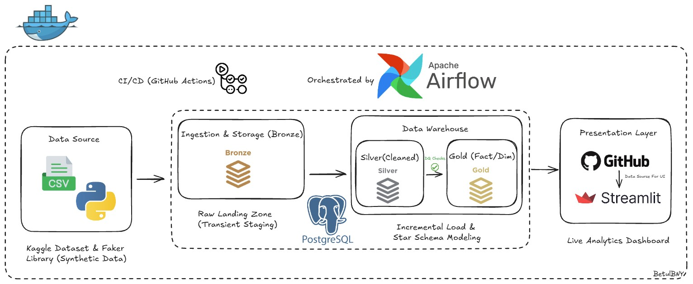
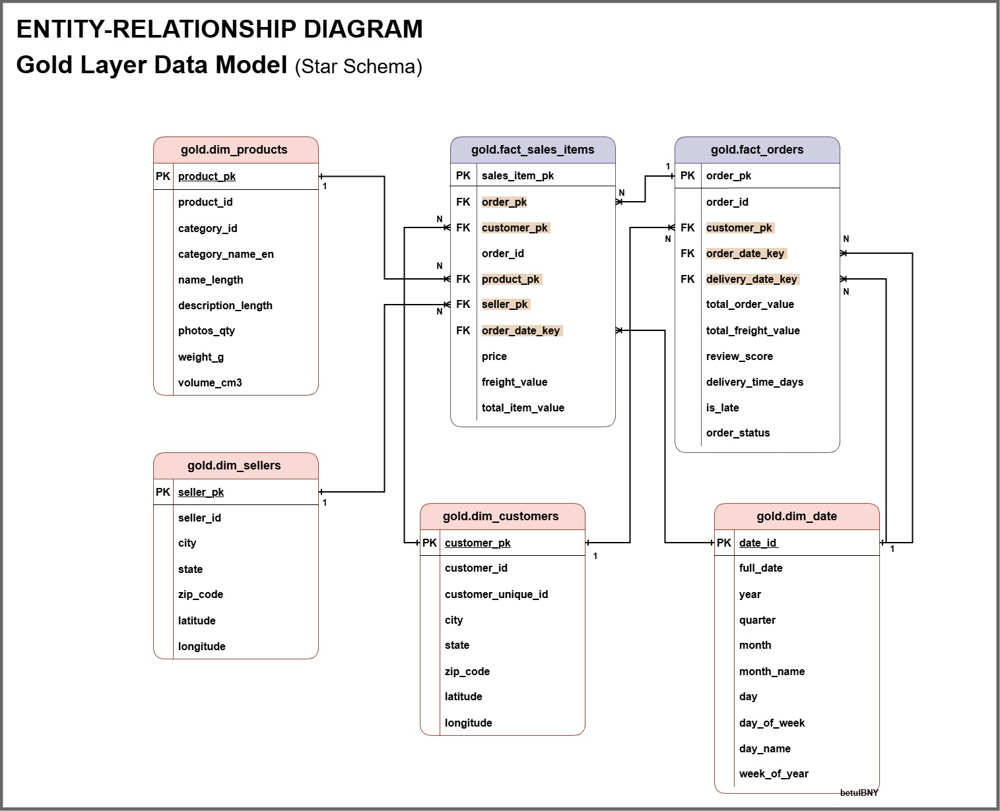
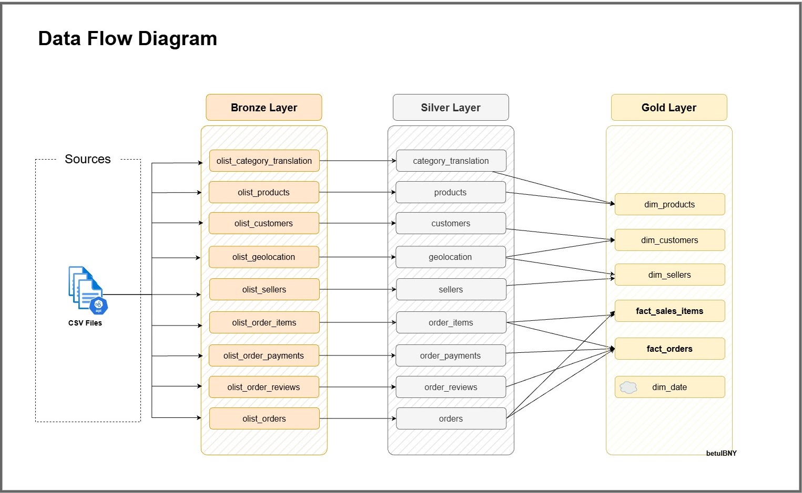
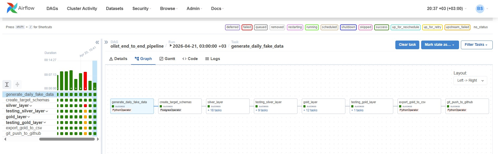
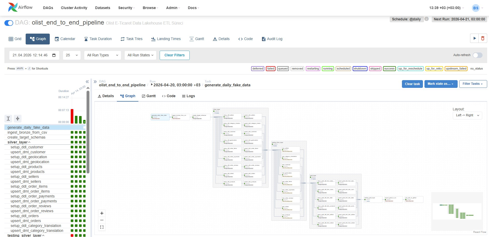
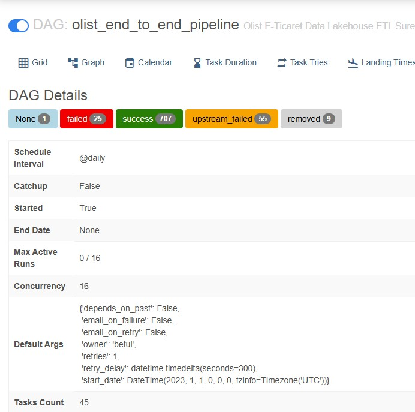
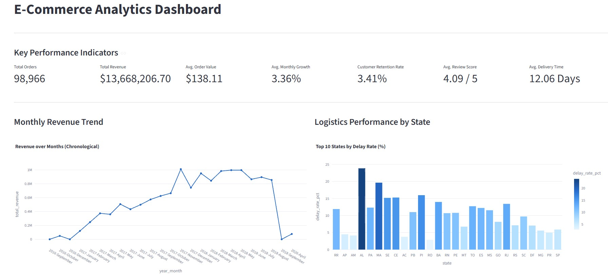
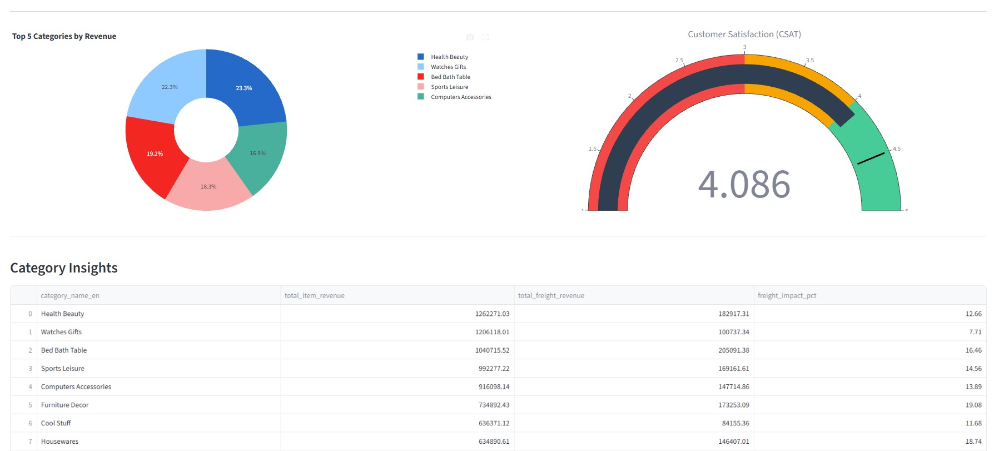
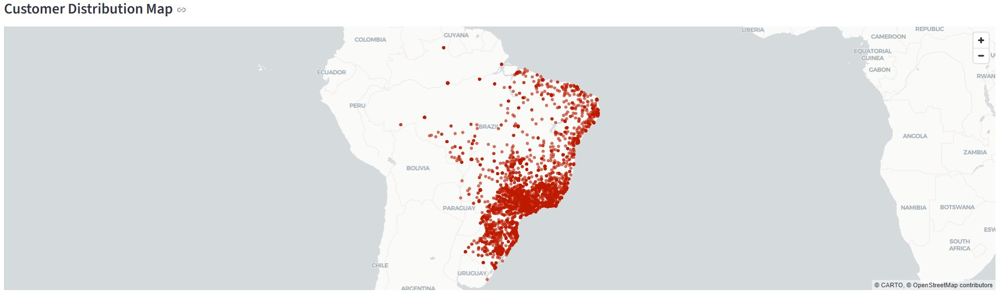

# E-Commerce Analytics Platform: End-to-End Data Pipeline

**[View the Live Dashboard here!](https://betul-ecommerce-dashboard.streamlit.app/)**

## Project Overview
This project is a fully containerized, autonomous Modern Data Platform that simulates an e-commerce environment. It leverages Docker for infrastructure portability and implements the Medallion Architecture (Bronze, Silver, Gold) within a PostgreSQL-based warehouse.

**🤖 The Autonomous Data Loop:**

Unlike static datasets, this system is a living engine. It operates in a self-sustaining cycle:
   - **Synthetic Data Generation:** A custom Python/Faker simulator injects fresh sales data into the Bronze layer daily.
   - **Incremental ELT:** Apache Airflow orchestrates the transformation of these raw records into the Silver (cleansed) and Gold (analytical) layers using Upsert (ON CONFLICT) logic.
   - **Automated Sync:** A dedicated Git-Sync Bot captures daily analytical snapshots and pushes them directly to GitHub.
   - **Live Updates:** The Streamlit Cloud dashboard detects these updates instantly, providing real-time visibility into business KPIs without any manual intervention.

The result is a production-grade data lifecycle that manages everything from raw ingestion and Data Quality validation to cloud-based visualization—entirely automated.

---

### **Tech Stack at a Glance**

| Category | Technology |
| :--- | :--- |
| **Language** |   |
| **Storage & DB** |  |
| **Orchestration** |  |
| **Infrastructure** |   |
| **Visualisation** |   |
| **CI/CD & Tools** |    |

---

## System Architecture

The project is designed using the **Medallion Architecture (Bronze, Silver, Gold)** to ensure scalable, maintainable, and analytics-ready data processing.



<p align="center"><i>Figure 1: High-level architectural overview illustrating the automated data flow from ingestion to visualization, managed within a containerized Docker environment.</i></p>

### Data Layers:

1. **Bronze (Raw Ingestion Layer):**
   - Ingests raw CSV files and synthetic transactional data into PostgreSQL.
   - Data is stored as-is with minimal transformation to preserve source fidelity.
   - Serves as a historical source for reprocessing and auditing.

2. **Silver (Cleansed & Enriched Layer):**
   - Applies data cleaning, standardization, and enrichment:
     - Address normalization
     - Missing product attributes imputation
   - Instead of full refresh, implemented **incremental loading** using UPSERT logic to efficiently process only new and updated records.
   - Data is modeled using **Kimball principles** to prepare for analytics.
   - Chronological Validation: Implemented logical flags (e.g., is_valid_chronology) to detect system-level timestamp errors.
   - Master Data Alignment: Synchronized customer and seller locations using master geolocation reference data.

3. **Gold (Analytics / BI Layer):**
   - Contains **fact and dimension tables** in a **star schema** design.
   - Optimized for BI tools and dashboarding (e.g., Streamlit).
   - Supports key business metrics such as revenue, order volume, and AOV.
   - Acts as the single source of truth for reporting.


<p align="center"><i>Figure 2: Gold Layer Dimensional Model (Star Schema) optimized for efficient querying and BI dashboard performance.</i></p>


<p align="center"><i>Figure 3: Data transformation across Medallion layers, from raw data to a structured star schema.</i></p>

---

## Tech Stack & Engineering Highlights

- **Orchestration:** Apache Airflow manages end-to-end pipeline dependencies, ensuring reliable execution of Bronze → Silver → Gold transformations.




<p align="center"><i>Figure 4: Apache Airflow DAG demonstrating the end-to-end task dependencies, from synthetic data generation to automated GitHub synchronization.</i></p>

- **Database:** PostgreSQL 16 is used as the central ELT engine, where transformations are performed directly in-database to optimize performance and reduce data movement.
- **Infrastructure:** Fully containerized with Docker & Docker Compose to ensuring seamless reproducibility and consistent environments across local development and production.
- **Data Quality:** Implemented automated SQL-based data validation checks, including:
  - Chronological Integrity: Custom logic to detect and flag logical errors (e.g., shipping dates occurring before order approval).
  - Financial Reconciliation: Automated scripts to ensure total revenue remains consistent across all layers (Silver vs. Gold).
  - Status-Timeline Conflict Detection: Specific checks for impossible states, such as "Canceled" orders having a delivery timestamp.
  - Master Data Sync: Ensuring 100% referential integrity between fact tables and dimensions (e.g., matching 100% of customers and products).
- **Automation:** Developed a custom Python Git-Sync Bot that periodically snapshots Gold-layer analytical views as CSVs and pushes them to GitHub. This enables a file-based data delivery pipeline for the Streamlit dashboard.
- **CI/CD:**  Integrated GitHub Actions with SQLFluff and Flake8 to enforce enterprise-grade code standards and maintain high maintainability of the ETL codebase.

---

##  Analytics Dashboard (Streamlit)

The frontend provides near real-time business insights based on Gold-layer:

- **Sales Performance:** Monthly revenue trends, order volume, and growth rate analysis.
- **Logistics Efficiency:** State-level delivery time distribution and late delivery rate analysis.
- **Category Insights:** Profitability analysis comparing high-revenue vs. high-shipping-cost product categories.
- **Geospatial Analysis:** Customer distribution and order density visualization across Brazil.

👉 **[View the Live Dashboard here!](https://betul-ecommerce-dashboard.streamlit.app/)**
<p align="center">
  
   
  
</p>
<p align="center"><i>Figure 5: Interactive dashboard sections showcasing Sales, Logistics, and Category analytics.</i></p>

---

## How to Run Locally

### Prerequisites:
*   Docker & Docker Compose
*   Git

### Installation & Initialization:

1.  **Clone the Repository:**
    ```bash
    git clone https://github.com/BetulBNY/ecommerce-data-lakehouse.git
    cd ecommerce-data-lakehouse
    ```

2.  **Configuration:** Create a `.env` file from the example and fill in your credentials.
    ```bash
    cp .env.example .env
    ```

3.  **Launch Docker Containers:** Build and start the Airflow, DB, and Dashboard services.
    ```bash
    docker-compose up -d --build
    ```

4.  **Initial Bootstrap (First-time Run):**
    To populate the historical 100k records, ensure the `task_ingest_bronze` is active in `dags/olist_lakehouse_dag.py` for the first run.
    *   Initialize Airflow DB: `docker exec -it airflow_webserver airflow db init`
    *   Trigger the DAG from Airflow UI (`localhost:8080`).
    *   **Optimization:** Once the initial historical load is complete, you can comment out `task_ingest_bronze` to optimize performance and proceed with daily incremental fake data generation.

5.  **Accessing the Dashboard:**
    *   Open your browser and go to: `http://localhost:8501`

---

## 🔮 Future Roadmap
*   Migration of the Bronze layer to **S3/MinIO (Object Storage)** for true Lakehouse separation of storage and compute.
*   Implementation of **Apache Spark** for processing larger datasets (>100M rows).
*   Adding **Slack/Email alerts** for Data Quality failures.

---
**Author:** [Betül Nur YILDIRIM] - [https://www.linkedin.com/in/betulnuryildirim/]

---
